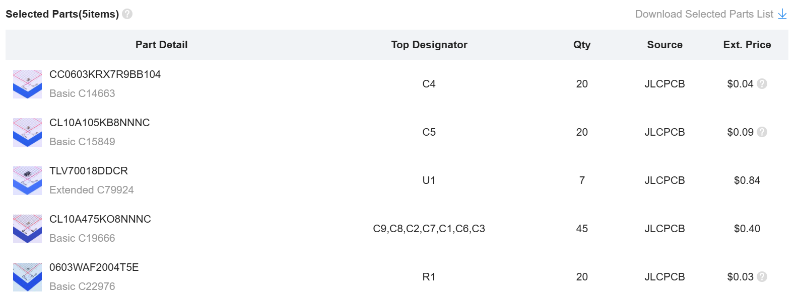

# Excuse

This is alpha version of Ploopy Adept BLE modification.

All necessary files are here but they are still messy.

Document may not reach your satisfaction.

## electronics

Designed by KiCAD and produted by [JLCPCB](https://jlcpcb.com/)

Basically you need XIAO nRF52840 board, PMW3610 optical sensor, omron D2LS-21 mouse switch, 6-pin slide switch and battery.

Other parts are set as below.

## firmware

Here includes uf2 file built by zmk.

You can find the code [here](https://github.com/taichan1113/mouse-test/tree/main).

## housing

I designed like you only need bottom modified housing additionally.

Note that put the battery wire not to interfere both top and bottom housings.

And you need to cut battery switch so as not to interfere the desk surface.
